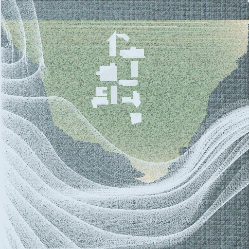

# wardisland
Ward Island represented using 2D OpenGL primitives

**Work in progress!**

## Output image (current version)

### Install

    sudo apt-get install libglu1-mesa-dev freeglut3-dev mesa-common-dev
    sudo apt-get install libglfw3-dev

    pip install numpy
    pip install cython
    pip install pyopengl
    pip install triangle
    pip install glumpy

