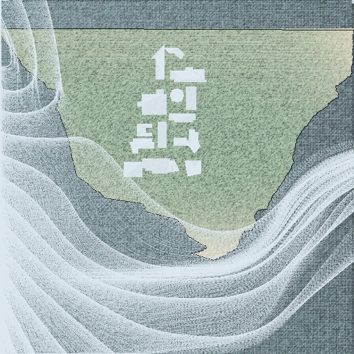

# wardisland
### COSC 4328 Programming Assignment 1
#### Evan Krell
#### Time: ~15 hours

### Part 1: Ward Island using 2D OpenGL primitives

The image is a map of TAMUCC with a selection of buildings. 
An objective was to give the image a fabric-like appearance.

The map is generated by drawing strips made of numerous tiny triangles.
The island is drawn one strip at a time. Each strip's start and stop is determined by an array of _nudges_ that shifts both ends indepedently. Negative nudges are used to increase the strip length, such as the small peninsula at the bottom tip. Each triangle vertex color is randomly selected from an array of terrain-like greens. 

Near the shore some sandy color is visible. This was produced by replicating the island shape, randomly assigning sandy colors, and setting the opacity with a gradient. A point is selected where the distance from that point determines the opacity. This was done twice to make two sandy regions. 

The background is also generated using the strips, but with all nudges set to 0 to form a rectangle. 

The buildings are each an assemblage of triangles, constructed in their own coordinate space.
They are scaled and translated for placement on the island. 
           
### Part 2: Ward Island with weather visualization

The wind visual is based on the interaction of a vector field and a number of _agents_ that enter the scene with an initial velocity. The 5500 agents are initialy spaced along the left edge and have directions that vary in the range -pi/2 to pi/2 and their magnitudes oscillate from 0 to 1 using cosine. The agents are modified by 5x5 grid of hard-coded vector field values. This grid is then interpolated (upscaled) to 100x100. As the agents move, their velocity is modified by
the vector field to acheive the behavior shown. The trajectories of each agent are recorded to produce the lines. The use of 5500 agents created a guaze-like effect to enhance the fabric theme. 

### Sources

[Python & OpenGL for Scientific Visualization](https://www.labri.fr/perso/nrougier/python-opengl): Learned basic OpenGL in Python. 
           
### Install & Run 

**Install OpenGL**

    sudo apt-get install libglu1-mesa-dev freeglut3-dev mesa-common-dev
    sudo apt-get install libglfw3-dev

**Install Python libraries**

    pip install numpy
    pip install cython
    pip install pyopengl
    pip install triangle
    pip install glumpy
    pip install scipy

**Execute**

    python3 draw-wardisland.py

